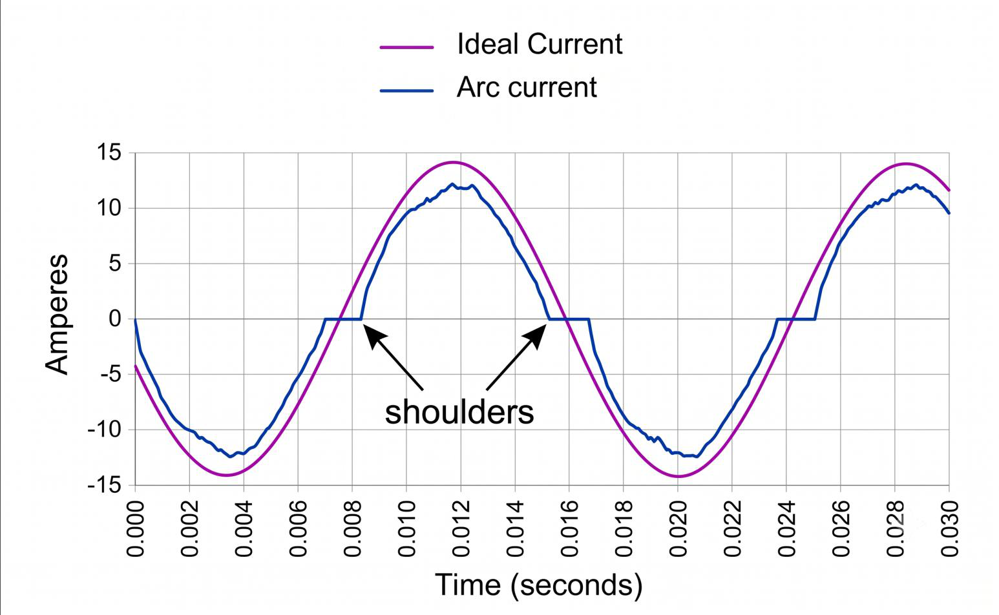
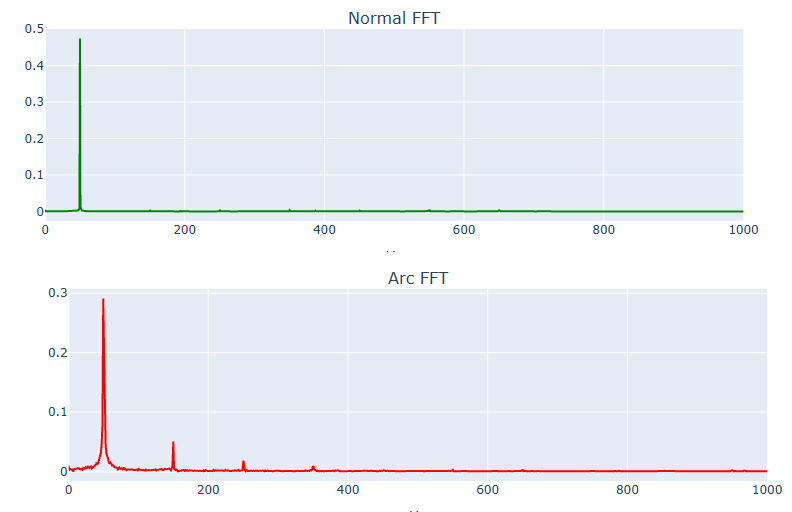
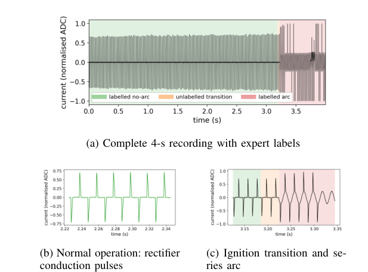
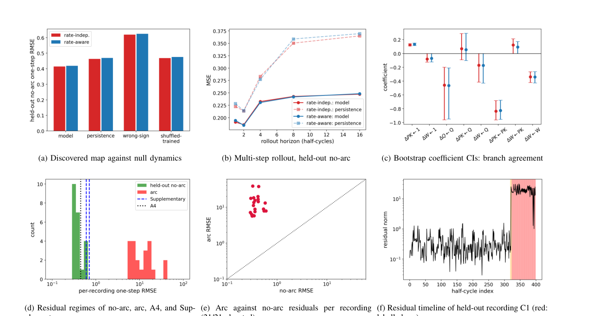
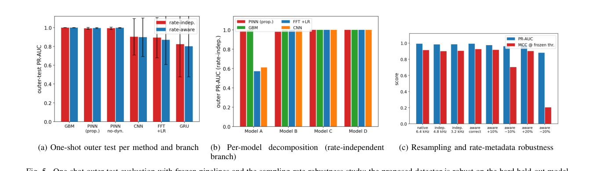

# ⚡ Arc Fault Data Study — Residential Loads Dataset


-informational)


[](https://colab.research.google.com/github/JehadMajed/FutureEnergyLab/blob/main/ArcFault/Arc_Fault_Data_Study.ipynb)

> **A curated experimental dataset and analysis notebook for series and parallel arc fault detection on residential electrical loads.**

---

## 📋 Table of Contents

- [Overview](#overview)
- [Repository Contents](#repository-contents)
- [Dataset Description](#dataset-description)
  - [Load Types](#load-types)
  - [AFCI Device Models (A–D)](#afci-device-models-ad)
  - [Arc Fault Types](#arc-fault-types)
  - [Label File](#label-file)
- [Notebook Structure](#notebook-structure)
- [Signal Description](#signal-description)
- [Analysis Features](#analysis-features)
- [Signal Analysis Examples](#signal-analysis-examples)
- [PINN Detection Framework](#pinn-detection-framework)
- [Requirements](#requirements)
- [How to Use](#how-to-use)
- [Dataset Statistics](#dataset-statistics)
- [Contact](#contact)

---

## Overview

This repository contains an experimental dataset and a comprehensive analysis notebook studying **arc fault phenomena on common residential loads**. The data was acquired in a **laboratory setting with controlled arc fault injection**, covering a wide range of real-world residential appliances and AFCI (Arc Fault Circuit Interrupter) device models.

The study aims to support:
- **Electrical engineers** developing or evaluating AFCI protection devices.
- **Machine learning researchers** building data-driven arc fault detection algorithms.
- **Researchers** investigating arc fault signatures across diverse load types and device configurations.

---

## Repository Contents

```
Arc_Fault/
├── Arc_Fault_Data_Study.ipynb   # Main analysis notebook (Google Colab)
├── Arc_data_label.xlsx          # Master label file with segment indices for all trials
└── Data Description.pdf         # Data description and experimental details (PDF)
```

> **Note:** The raw measurement Excel files (per-load `.xlsx` files) are stored externally and are referenced by the notebook via `BASE_PATH`. See [How to Use](#how-to-use) for setup instructions.

---

## Dataset Description

### Load Types

The dataset covers **10 residential load categories**, tested under both normal and arc-fault conditions:

| # | Load Type | Description |
|---|-----------|-------------|
| 1 | **Halogen Lamp** | Resistive incandescent/halogen lighting load |
| 2 | **Fluorescent Lamp** | Fluorescent lamp with ballast |
| 3 | **Electric Power Tool** | Motor-driven power tool (e.g., drill) |
| 4 | **Vacuum Cleaner** | Single-phase motor vacuum cleaner |
| 5 | **Switching Power Supply** | SMPS-based electronic load |
| 6 | **Electronic Dimmer (60°)** | Phase-cut dimmer at 60° firing angle |
| 7 | **Electronic Dimmer (90°)** | Phase-cut dimmer at 90° firing angle |
| 8 | **Electronic Dimmer (120°)** | Phase-cut dimmer at 120° firing angle |
| 9 | **Air Compressor** | Inductive motor-driven air compressor |
| – | **Household Loads** | Combined / multi-load household configurations |

Additional supplementary categories include:
- **Series Arc Fault** (direct series arc tests, 6 A–40 A range)
- **Parallel Arc Fault** (line-to-neutral / line-to-ground arcs)
- **EMI** (electromagnetic interference reference measurements)
- **Resistive 5A** (baseline resistive load with crosstalk tests)
- **Maximum / Minimum Angle** (dimmer firing angle boundary tests)

---

### AFCI Device Models (A–D)

Each load type was tested using **four different AFCI device models** (anonymized as Model A, B, C, and D) to capture variability across hardware implementations.

---

### Arc Fault Types

Both types of arc faults were induced under controlled laboratory conditions:

| Arc Type | Description |
|----------|-------------|
| **Series Arc Fault** | Arc occurring in series with the load (damaged conductor, loose connection) |
| **Parallel Arc Fault** | Arc occurring between live and neutral/ground conductors (insulation breakdown) |

Each trial recording includes a **no-arc (normal operation) segment** followed by an **arc fault segment**, with precise sample indices labeled in the master label file.

---

### Label File

**`Arc_data_label.xlsx`** is the master annotation file containing segment boundary indices for every trial.

| Column | Description |
|--------|-------------|
| `data_name` | Unique trial identifier (e.g., `HalogenLamp_A2`) |
| `data_path` | AFCI device model (`Model_A` / `Model_B` / `Model_C` / `Model_D`) |
| `type_label` | Numeric class label encoding load type + device model combination |
| `st_idx_noarc` | Start sample index of the **no-arc (normal)** segment |
| `ed_idx_noarc` | End sample index of the **no-arc (normal)** segment |
| `st_idx_arc` | Start sample index of the **arc fault** segment |
| `ed_idx_arc` | End sample index of the **arc fault** segment (`-1` = extends to end of file) |

> **Tip:** Entries with `st_idx_arc = 0` and `ed_idx_arc = 0` indicate no arc event was captured for that trial.

The label file contains **258 labeled trial records** across all load types and device models.

---

## Notebook Structure

**`Arc_Fault_Data_Study.ipynb`** is a Google Colab notebook organized as follows:

```
1.  Halogen Lamp Dataset
    ├── False Trip
    ├── Model A → D
2.  Fluorescent Lamp Dataset
    └── Model A → D
3.  Electric Power Tool Dataset
    └── Model A → D
4.  Resistive 5A Dataset
    └── Crosstalk tests 1–4
5.  Switching Power Supply Dataset
    ├── Model A → D
    └── Supplementary Data
6.  Vacuum Cleaner Dataset
    ├── Model A → D
    └── New / Updated recordings
7.  Household Loads
    ├── Single Household Load
    └── Two-Load Household Configuration
8.  Electronic Dimmer Dataset
    ├── Model A → D
    ├── Angle variants (60°, 90°, 120°)
    └── Supplementary Data
9.  Air Compressor Dataset
    ├── Model A → D
    └── Supplementary Data
10. Series Arc Dataset
    ├── General series arcs
    ├── 6A–13A range
    └── 20A–40A range
11. Parallel Arc Dataset
12. EMI Dataset
13. ResNet 1D Architecture
    └── Model architecture diagrams
14. Final Model Testing (V2)
```

---

## Signal Description

| Property | Value |
|----------|-------|
| **Measured signal** | AC Current (I) |
| **Sampling rate** | 6.4 kHz |
| **Format** | Microsoft Excel (`.xlsx`), one column per trial |
| **Units** | Amperes (A) |
| **Recording conditions** | Controlled laboratory, 230 V AC, 50 Hz mains |

Each `.xlsx` raw data file contains multiple columns — one per trial — with raw current waveform samples stored sequentially (no header row).

---

## Analysis Features

The **Unified Research Dashboard** (implemented inside the notebook) provides interactive visualizations for each dataset, including:

| Feature | Description |
|---------|-------------|
| 📊 **Histogram** | Distribution of current sample amplitudes |
| 📈 **di/dt** | Current derivative — highlights fast arc-induced transients |
| 🔁 **RMS** | Short-window RMS current — captures amplitude changes |
| 🎵 **FFT** | Frequency spectrum of the current signal |
| 🌈 **Spectrogram** | Time-frequency representation using short-time Fourier transform |
| 🔲 **Waveform View** | Raw current waveform with labeled no-arc and arc segments |

A dropdown widget allows switching between trial numbers interactively.

---

## Signal Analysis Examples

**Time domain** — the arc current visibly departs from the ideal sine wave: flat "shoulders"
at current zero-crossing (the arc extinguishes and re-ignites) plus conduction collapse:



**Frequency domain** — a clean sinusoid produces one sharp spectral line; the arc adds
broadband energy and low-order harmonic content:



---

## PINN Detection Framework

A **sampling-rate-independent, current-only Physics-Informed Neural Network (PINN)** for
series arc-fault detection in switching power supplies — manuscript submitted (see
[docs/PUBLICATIONS.md](../docs/PUBLICATIONS.md)). Rather than assuming an arc equation, the
nominal (healthy) device dynamics are **discovered from data with SINDy** — a stable linear
charge-balance contraction map, independently verified — and only then embedded in the
detector.



### Contribution

- **Current-only, voltage-free detection** — no branch-voltage sensor required.
- Nominal SMPS dynamics discovered from data with SINDy, independently verified — not an
  assumed arc equation.
- A causal period estimator removes all dependence on the sampling rate.
- The classical Mayr / Cassie arc-plasma equations are shown to be **unidentifiable from
  current-only data** — documented and rejected as a modelling basis.



### Results (one-shot, leave-one-SMPS-model-out test)

- **Average precision 0.9924** with no sampling-rate knowledge (0.9954 with it); **105/105**
  arc events detected, median detection delay of 0 half-cycles.
- **0.59 false alarms / 100 cycles** — 3–10× better than the accuracy-leading benchmarks
  (GBM 2.0–5.6, FFT+LR 4.7–5.4 false alarms/100 cycles).
- **Rate-robust**: AP 0.984–0.985 after resampling to 4.8 / 3.2 kHz with no rate information;
  by contrast, a −20% assumed-rate error collapses a rate-*aware* detector to MCC 0.20.
- Physics helps most when the encoder is weak (+0.05 to +0.07 AP) and is performance-neutral
  at the accuracy ceiling — reported honestly rather than oversold.



---

## Requirements

The notebook is designed to run on **Google Colab**. Local execution requires the following Python packages:

```
pandas
numpy
scipy
plotly
ipywidgets
openpyxl
```

Install locally with:

```bash
pip install pandas numpy scipy plotly ipywidgets openpyxl
```

---

## How to Use

1. **Clone or download this repository.**

2. **Obtain the raw measurement data** (external `.xlsx` files per load/model) and organize them into folders matching the expected structure:

   ```
   BASE_PATH/
   ├── Halogen Lamp dataset/
   │   ├── Halogen_Lamp_(Model_A).xlsx
   │   ├── Halogen_Lamp_(Model_B).xlsx
   │   └── ...
   ├── Fluorescent Lamp dataset/
   ├── Electric Power Tool dataset/
   ├── Vacuum Cleaner dataset/
   ├── Switching power supply dataset/
   ├── Electronic Dimmer dataset/
   ├── Air Compressor dataset/
   ├── Series Arc dataset/
   ├── Parallel Arc dataset/
   └── EMI dataset/
   ```

3. **Open `Arc_Fault_Data_Study.ipynb`** in Google Colab (or Jupyter).

4. **Set the `BASE_PATH` variable** at the top of the notebook to point to your data directory.

5. **Run each section** independently. Each cell loads the relevant dataset, applies the labeled indices, and renders an interactive dashboard.

6. **Use the label file** (`Arc_data_label.xlsx`) to integrate the dataset into your own machine learning pipeline — it provides ready-to-use segment boundaries for extracting no-arc and arc windows.

---

## Dataset Statistics

| Metric | Value |
|--------|-------|
| Total labeled trials | 258 |
| AFCI device models | 4 (A, B, C, D) |
| Residential load categories | 10+ |
| Arc fault types | Series + Parallel |
| Sampling rate | 6.4 kHz |
| Measured signal | Current (A) |
| Notebook cells | 121 |

---

## Contact

For questions or collaboration regarding this dataset or study, please open an issue in this repository.

---

*This dataset was collected as part of an arc fault detection research study on residential electrical loads.*
