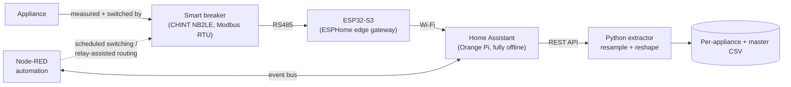

# Appliance-Level Power Data Acquisition Toolkit


**Data Setup** is an open, reproducible edge-computing rig for **isolating, switching, and continuously
logging the active-power signatures of individual household appliances**.

Each appliance is wired through its own **Data Acquisition (DAQ) node** built around a smart
metering breaker and an ESP32-S3. Measurements (voltage, current, active power, breaker status)
are polled over Modbus RTU, collected offline by Home Assistant, and exported by a Python pipeline
into clean, resampled, wide-format CSV time series ready for analysis or machine learning.

The reference deployment covered **21 diverse appliances** running 24/7 in a laboratory for
several months, with a 100% automated-switching success rate and 0.5–1.0 s command latency.

---

## 📋 Table of Contents

- [Why This Exists](#why-this-exists)
- [Who Is This For?](#who-is-this-for)
- [Appliance Inventory](#appliance-inventory)
- [Hardware — The DAQ Node](#hardware--the-daq-node)
- [Architecture](#architecture)
- [Node-RED Automation](#node-red-automation)
- [Commissioning Challenges](#commissioning-challenges)
- [Sample Data](#sample-data)
- [Output Data Schema](#output-data-schema)
- [Reference Deployment Results](#reference-deployment-results)
- [What's in the Box](#whats-in-the-box)
- [Quick Start (Software Only)](#quick-start-software-only)
- [Status](#status)
- [License](#license)

---

## Why This Exists

A smart meter's value is what it can infer from a single measurement point — but every
inference model (theft detection, load forecasting, load disaggregation/NILM) has to be
trained on **per-appliance ground-truth data** first, and that data doesn't exist off the
shelf. This toolkit exists to produce exactly that: a labelled, time-synchronised,
per-appliance active-power dataset with known switching events. It shares its core hardware
approach (ESP32 + CHINT smart breaker) with the lab's **[Smart Meter](../Smart%20Meter/)**
project (Intelli-Meter) and is expected to converge with it as both mature — see
[Smart Meter's "Relationship to Data Setup"](../Smart%20Meter/README.md#relationship-to-data-setup)
for the current state.

---

## Who Is This For?

- **Energy / load-signature researchers** who need a ground-truth, per-appliance active-power
  dataset with known switching events (NILM, disaggregation, load classification, demand modelling).
- **Smart-home and home-lab builders** who want per-circuit monitoring *and* control with a fully
  offline, cloud-free stack.
- **Educators and students** in power/instrumentation courses who want a documented, buildable
  DAQ node and data pipeline to adapt.

---

## Appliance Inventory

The reference deployment instruments **21 appliances**, classified by electrical behaviour and
by which [integration block](#architecture) (A = single-mode, B = multi-mode) they need:

<details>
<summary><strong>Full inventory (21 devices) — click to expand</strong></summary>

| Device                   | Electrical Category        | Block | Typical Operating Nature                             |
| ------------------------ | -------------------------- | :---: | ---------------------------------------------------- |
| Electric Stove           | Resistive / Thermal        | B     | Multi-level or cyclic thermal operation              |
| Heater                   | Resistive / Thermal        | A     | Direct single-state heating load                     |
| Oil Heater               | Resistive / Thermal        | A     | Predominantly thermal single-state operation         |
| Air Fryer                | Mixed Thermal / Electronic | A     | Heater and fan with timer-based control              |
| Iron                     | Resistive / Thermal        | A     | Direct thermal ON/OFF operation                      |
| Toaster                  | Resistive / Thermal        | A     | Short-cycle resistive heating                        |
| Coffee Machine           | Mixed Thermal / Electronic | B     | Heater and pump sequence with multiple stages        |
| Split Air Conditioner    | Motor / Compressor         | A     | Compressor-based steady operation                    |
| Top-Load Washing Machine | Motor-Driven               | B     | Multiple modes such as cotton 45 min and 15 min      |
| Twin-Tub Washing Machine | Motor-Driven               | B     | Separate wash and spin operating states              |
| Water Dispenser          | Mixed Compressor / Thermal | A     | Cooling and heating cycles controlled by the breaker |
| Blender                  | Universal Motor            | A     | Motor-driven operation with one speed                |
| Dishwasher               | Mixed Electro-Mechanical   | B     | Heater and pump sequence with multiple stages        |
| Hair Dryer               | Mixed Thermal / Fan        | A     | Heater plus fan operation                            |
| Hair Styler              | Mixed Thermal / Fan        | A     | Heater plus fan operation                            |
| Microwave Oven           | Mixed / Nonlinear          | A     | Multi-setting thermal operation                      |
| Lighting Panel           | Electronic / Nonlinear     | A     | Aggregated lighting switching behavior               |
| Television               | Electronic / Nonlinear     | A     | Continuous electronic consumption profile            |
| Kettle                   | Resistive / Thermal        | A     | Direct high-power heating event                      |
| Refrigerator             | Motor / Compressor         | A     | Automatic compressor cycling behavior                |
| Vacuum Cleaner           | Universal Motor            | A     | Motor-driven operation with variable intensity       |

</details>

Machine-readable version: [`data/appliances.csv`](data/appliances.csv).

---

## Hardware — The DAQ Node

Each appliance gets its own **Data Acquisition (DAQ) node**: the interface between the appliance,
the metering breaker, and the software layer. It measures (V / I / active power), switches
(motorised breaker latch + relay channels for multi-mode loads), and communicates upstream.

| Component                                  | Role                                                                |
| ------------------------------------------ | ------------------------------------------------------------------- |
| Smart metering breaker (CHINT NB2LE class) | Primary measurement + ON/OFF actuation via internal motor           |
| ESP32-S3                                   | Edge gateway: Modbus master, Wi-Fi uplink, command translation      |
| TTL-to-RS485 module                        | Converts ESP32 UART to RS485 differential signalling for Modbus RTU |
| Relay module (multi-channel)               | Selects sub-cycles / modes for multi-mode appliances                |
| AC/DC converter (5 V + 24 V)               | Powers logic and relays independently of breaker state              |
| Enclosure                                  | Protection, wiring organisation, wall-mount format                  |

Full per-node bill of materials: [`hardware/daq-node-bom.md`](hardware/daq-node-bom.md). Wiring
notes: [`hardware/wiring-notes.md`](hardware/wiring-notes.md).

> **Photos:** hardware/rig photos are not yet in this repository — to be added.

---

## Architecture



Two integration paths depending on appliance behaviour (see
[`docs/03-load-inventory.md`](docs/03-load-inventory.md)):

- **Block A — single-mode**: direct ON/OFF or stable signature. Breaker-centred node only.
- **Block B — multi-mode**: cyclic/sequential behaviour (compressor, motor sub-processes,
  heat+pump stages). Node is coordinated through both the breaker and the relay stage.

See [`docs/01-system-architecture.md`](docs/01-system-architecture.md) for the full breakdown.

---

## Node-RED Automation

**Node-RED** runs as a local workflow engine alongside ESPHome and Home Assistant, subscribing to
the Home Assistant event bus and turning timing conditions, schedules, and measurement-driven
events into ordered control actions — entirely local, no cloud dependency.

| Flow Type                   | What It Does                                                                                                                                                                                                  |
| --------------------------- | ------------------------------------------------------------------------------------------------------------------------------------------------------------------------------------------------------------- |
| **Binary-device flows**     | Direct breaker ON/OFF for single-mode appliances (lamps, kettles, heaters) — the flow toggles the breaker's internal latch, no secondary routing                                                              |
| **Multi-mode-device flows** | Coordinates breaker actuation with multi-channel relay routing to represent internal appliance modes (washing-machine cycles, oven modes): breaker delivers primary power, relay module selects the sub-cycle |

Patterns used: schedule-driven operation (periodic triggers, CSV-based schedules, local-time
logic), ordered switching sequences (breaker unlock → delayed actuation), and relay-path
selection for multi-mode devices. Full detail: [`docs/06-automation.md`](docs/06-automation.md).

---

## Commissioning Challenges

Deploying and commissioning the 21 independent DAQ nodes took roughly **6–8 months**. The main
technical challenge encountered:

> **Breaker over-frequency fault (60 Hz vs 65 Hz).** The CHINT NB2LE breakers exhibited
> persistent over-frequency alarm trips — the internal protection falsely registered a ~65 Hz
> network frequency and tripped immediately on the actual 60 Hz mains supply.
>
> **Resolution:** using the serial debug tool **SSCOM**, the breakers were interfaced directly
> via an RS485-to-TTL USB module, and proprietary hex commands were sent to recalibrate the
> frequency threshold and register mappings in the breaker's internal firmware. These are
> undocumented, device-specific commands — recalibrating protection thresholds affects safety
> behaviour, so this should only be attempted with a full understanding of the consequences for
> the grid and hardware involved.

After recalibration, communication was verified stable (see results below) and the poll interval
was tuned to 1000 ms to fully eliminate bus collisions. Full detail:
[`docs/07-commissioning-notes.md`](docs/07-commissioning-notes.md).

---

## Sample Data


*Illustrative only — generated from the bundled `examples/synthetic_sample.csv` via
`software/plotting/plot_power_profile.py`. It is a **synthetic** stand-in for a multi-mode
appliance (e.g. a washing machine's wash/spin cycles), not measured data — real reference-deployment
plots are not yet public.*

---

## Output Data Schema

The Python extractor produces two kinds of CSV, both on a uniform timestamp grid (default 1 s
resample, forward-filled from raw Home Assistant state changes):

**`per_appliance/<name>.csv`**

| Column           | Type              | Description                                         |
| ---------------- | ----------------- | --------------------------------------------------- |
| `timestamp`      | ISO 8601 datetime | Uniform grid at the resample interval (default 1 s) |
| `active_power_w` | float             | Active power draw of the appliance, watts           |

**`master.csv`**

| Column             | Type              | Description                                                  |
| ------------------ | ----------------- | ------------------------------------------------------------ |
| `timestamp`        | ISO 8601 datetime | Shared index across all appliances                           |
| `<appliance_name>` | float             | Active power (W) for that appliance; one column per DAQ node |

Processing pipeline: pull raw Home Assistant state changes (`/api/history/period`) → forward-fill
→ resample onto a fixed grid → reshape long → wide so every appliance shares one timestamp index.
Full detail: [`data/schema.md`](data/schema.md).

---

## Reference Deployment Results

From the 21-appliance, multi-month continuous deployment (full detail in
[`docs/08-results.md`](docs/08-results.md)):

| Area            | Result                                                                                                            |
| --------------- | ----------------------------------------------------------------------------------------------------------------- |
| Communication   | Consistent RS485 delivery across all nodes; 1000 ms polling, zero bus collisions                                  |
| Automation      | **100% automated-switching success rate**; zero firmware freezes or lockups                                       |
| Control latency | Node-RED trigger → physical breaker latch: **0.5–1.0 s**                                                          |
| Data extraction | Per-appliance CSV + synchronised master dataset; multi-mode transitions (e.g. washing machine) confirmed captured |
| Stability       | Fully offline stack (ESPHome + Home Assistant + Orange Pi); logging continuity immune to internet outages         |

---

## What's in the Box

| Path                                         | Contents                                                                        |
| -------------------------------------------- | ------------------------------------------------------------------------------- |
| [`docs/`](docs/)                             | Architecture, hardware, data pipeline, automation, commissioning notes, results |
| [`hardware/`](hardware/)                     | DAQ node bill of materials and wiring notes                                     |
| [`firmware/esphome/`](firmware/esphome/)     | ESPHome config for the ESP32-S3 ↔ breaker Modbus link                           |
| [`software/extractor/`](software/extractor/) | Python Home Assistant history → CSV pipeline                                    |
| [`software/plotting/`](software/plotting/)   | Quick power-profile plotting helper                                             |
| [`data/`](data/)                             | Output schema + the appliance inventory as machine-readable CSV                 |
| [`examples/`](examples/)                     | A **synthetic** sample profile so scripts run out of the box                    |

---

## Quick Start (Software Only)

```bash
cd software/extractor
python -m venv .venv && . .venv/Scripts/activate   # Windows; use .venv/bin/activate on Linux/macOS
pip install -r requirements.txt
cp config.example.yaml config.yaml                 # then edit host + token + entities
python ha_history_extractor.py --config config.yaml --days 1
```

To try the pipeline with no hardware, plot the bundled synthetic sample:

```bash
python software/plotting/plot_power_profile.py examples/synthetic_sample.csv
```

---

## Status

`v1.0.0` — data-acquisition and automation layer, validated in continuous operation.
See [`CHANGELOG.md`](CHANGELOG.md).

---

## License

MIT — see [`LICENSE`](LICENSE). Author: Jehad Majed, 2026.
