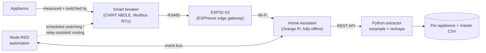
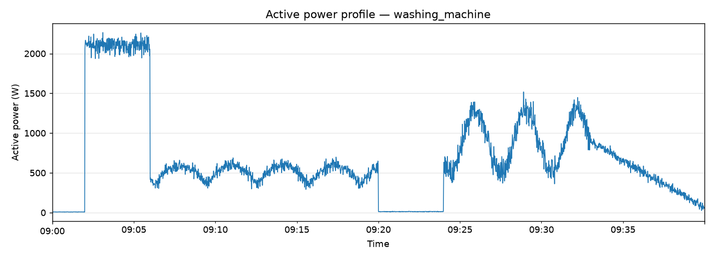

# Appliance-Level Power Data Acquisition Toolkit


**Data Setup** is an open, reproducible edge-computing rig for **isolating, switching, and continuously
logging the active-power signatures of individual household appliances**.

Each appliance is wired through its own **Data Acquisition (DAQ) node** built around a smart
metering breaker and an ESP32-S3. Measurements (voltage, current, active power, breaker status)
are polled over Modbus RTU, collected offline by Home Assistant, and exported by a Python pipeline
into clean, resampled, wide-format CSV time series ready for analysis or machine learning.

The reference deployment covered **21 diverse appliances** running 24/7 in a laboratory for
several months, with a 100% automated-switching success rate and 0.5–1.0 s command latency.

---

## Why this exists

A smart meter's value is what it can infer from a single measurement point — but every
inference model (theft detection, load forecasting, load disaggregation/NILM) has to be
trained on **per-appliance ground-truth data** first, and that data doesn't exist off the
shelf. This toolkit exists to produce exactly that: a labelled, time-synchronised,
per-appliance active-power dataset with known switching events. It is the data foundation
for the lab's **[Smart Meter](../Smart%20Meter/)** project.

## Who is this for?

- **Energy / load-signature researchers** who need a ground-truth, per-appliance active-power
  dataset with known switching events (NILM, disaggregation, load classification, demand modelling).
- **Smart-home and home-lab builders** who want per-circuit monitoring *and* control with a fully
  offline, cloud-free stack.
- **Educators and students** in power/instrumentation courses who want a documented, buildable
  DAQ node and data pipeline to adapt.

## What's in the box

| Path | Contents |
|------|----------|
| [`docs/`](docs/) | Architecture, hardware, data pipeline, automation, commissioning notes, results |
| [`hardware/`](hardware/) | DAQ node bill of materials and wiring notes |
| [`firmware/esphome/`](firmware/esphome/) | ESPHome config for the ESP32-S3 ↔ breaker Modbus link |
| [`software/extractor/`](software/extractor/) | Python Home Assistant history → CSV pipeline |
| [`software/plotting/`](software/plotting/) | Quick power-profile plotting helper |
| [`data/`](data/) | Output schema + the appliance inventory as machine-readable CSV |
| [`examples/`](examples/) | A **synthetic** sample profile so scripts run out of the box |

## Hardware — the DAQ node

Each appliance gets its own **Data Acquisition (DAQ) node**: the interface between the appliance,
the metering breaker, and the software layer. It measures (V / I / active power), switches
(motorised breaker latch + relay channels for multi-mode loads), and communicates upstream.

| Component | Role |
|---|---|
| Smart metering breaker (CHINT NB2LE class) | Primary measurement + ON/OFF actuation via internal motor |
| ESP32-S3 | Edge gateway: Modbus master, Wi-Fi uplink, command translation |
| TTL-to-RS485 module | Converts ESP32 UART to RS485 differential signalling for Modbus RTU |
| Relay module (multi-channel) | Selects sub-cycles / modes for multi-mode appliances |
| AC/DC converter (5 V + 24 V) | Powers logic and relays independently of breaker state |
| Enclosure | Protection, wiring organisation, wall-mount format |

Full per-node bill of materials: [`hardware/daq-node-bom.md`](hardware/daq-node-bom.md). Wiring
notes: [`hardware/wiring-notes.md`](hardware/wiring-notes.md).

> **Photos:** hardware/rig photos are not yet in this repository — to be added.

## Architecture



Two integration paths depending on appliance behaviour (see
[`docs/03-load-inventory.md`](docs/03-load-inventory.md)):

- **Block A — single-mode**: direct ON/OFF or stable signature. Breaker-centred node only.
- **Block B — multi-mode**: cyclic/sequential behaviour (compressor, motor sub-processes,
  heat+pump stages). Node is coordinated through both the breaker and the relay stage.

See [`docs/01-system-architecture.md`](docs/01-system-architecture.md) for the full breakdown.

## Sample data



*Illustrative only — generated from the bundled `examples/synthetic_sample.csv` via
`software/plotting/plot_power_profile.py`. It is a **synthetic** stand-in for a multi-mode
appliance (e.g. a washing machine's wash/spin cycles), not measured data — real reference-deployment
plots are not yet public.*

## Reference deployment results

From the 21-appliance, multi-month continuous deployment (full detail in
[`docs/08-results.md`](docs/08-results.md)):

| Area | Result |
|---|---|
| Communication | Consistent RS485 delivery across all nodes; 1000 ms polling, zero bus collisions |
| Automation | **100% automated-switching success rate**; zero firmware freezes or lockups |
| Control latency | Node-RED trigger → physical breaker latch: **0.5–1.0 s** |
| Data extraction | Per-appliance CSV + synchronised master dataset; multi-mode transitions (e.g. washing machine) confirmed captured |
| Stability | Fully offline stack (ESPHome + Home Assistant + Orange Pi); logging continuity immune to internet outages |

## Quick start (software only)

```bash
cd software/extractor
python -m venv .venv && . .venv/Scripts/activate   # Windows; use .venv/bin/activate on Linux/macOS
pip install -r requirements.txt
cp config.example.yaml config.yaml                 # then edit host + token + entities
python ha_history_extractor.py --config config.yaml --days 1
```

To try the pipeline with no hardware, plot the bundled synthetic sample:

```bash
python software/plotting/plot_power_profile.py examples/synthetic_sample.csv
```

## Status

`v1.0.0` — data-acquisition and automation layer, validated in continuous operation.
See [`CHANGELOG.md`](CHANGELOG.md).

## License

MIT — see [`LICENSE`](LICENSE). Author: Jehad Majed, 2026.
