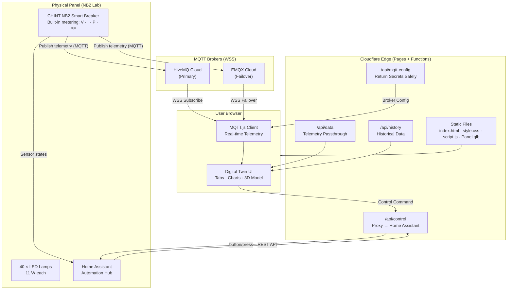

<div align="center">

---

## 📋 Table of Contents

- [What Is This?](#what-is-this)
- [Live System Specifications](#live-system-specifications)
- [Features](#features)
- [System Architecture](#system-architecture)
- [Tech Stack](#tech-stack)
- [Project Structure](#project-structure)
- [Quick Start (Local Dev)](#quick-start-local-dev)
- [Deployment (Cloudflare Pages)](#deployment-cloudflare-pages)
- [Environment Variables / Secrets](#environment-variables--secrets)
- [Academic Attribution](#academic-attribution)
- [Contributing](#contributing)

---

## What Is This?

A **Digital Twin** is a dynamic, software-based virtual mirror of a physical asset. Unlike a static 3D model, a true digital twin is **continuously synchronized** with its real-world counterpart through live IoT telemetry and sensor feeds.

This project is a full-stack cloud application that acts as the digital twin for a physical **40-lamp residential lighting distribution panel (NB2)** at Prince Sattam bin Abdulaziz University. It was built as an academic research project in applied power systems, IoT telemetry, and smart-grid automation.

Key capabilities:

- **Sub-second MQTT telemetry** from live IoT sensors on the physical panel
- **Remote panel control** (Open / Close / Unlock) via Home Assistant API
- **3D interactive model** of the physical panel using WebGL / `<model-viewer>`
- **Thermal-electrical physics simulation** predicting lamp junction temperatures and lumen decay
- **SCADA-style alarm system** (ISA-101 severity levels, acknowledge/clear workflow)
- **Verified historical analytics** with Chart.js (power, PF, efficiency, energy, CO₂)

---

## Live System Specifications

| Parameter                | Value                                                    |
| ------------------------ | -------------------------------------------------------- |
| Lamp Model               | Philips Essential LEDbulb 11 W E27 4000 K (929002299709) |
| Load Count               | **40 lamps** (8 columns × 5 rows)                 |
| Nameplate Power          | 440 W (40 × 11 W)                                       |
| Measured Power           | **402 W** (10.05 W per lamp)                       |
| Supply Voltage           | 229.7 V measured · 220–240 V rated window              |
| Operating Current        | 2.93 A at PF 0.597 — measured                           |
| Luminous Flux / Efficacy | 1,200 lm at 109 lm/W — datasheet                        |
| Rated Life (L70)         | 12,000 h to 70% lumen maintenance                        |
| Max T-case / Ambient     | 95 °C / −20 to +45 °C                                 |
| Thermal Resistance Rₜₕ | 5.5 °C/W — modelled                                    |

---

## Features

### 📊 Tab 1 — Data Overview

- Live KPI cards: **Power · Voltage · Current · PF · Energy · CO₂**
- Animated real-time trend charts (power, voltage, current, power factor)
- Historical analytics with date-range picker (energy, efficiency, cost, CO₂, comparison)
- Panel snapshot: per-circuit breaker status

### Tab 2 — 3D Model & Control

- Interactive 3D GLB model of the physical panel (drag, rotate, zoom)
- Remote control buttons (Unlock / Open / Close) relayed via Cloudflare → Home Assistant
- Live annotation overlays on the 3D model

### 🔬 Tab 3 — Simulation & Scenarios

- Physics-based thermal model: junction temperature = f(power, ambient, Rₜₕ)
- Lumen maintenance curve following IES TM-21 extrapolation
- Scenario engine: aging multiplier, dimming %, ambient temperature, partial failures
- SCADA alarm panel (critical / warning, acknowledge, filter, export)
- Export: run CSV · lamp table CSV · summary report

### ℹ️ Tab 4 — About

- Project description, university info, core specifications

---

## System Architecture



---

## Tech Stack

| Layer                  | Technology                                                 |
| ---------------------- | ---------------------------------------------------------- |
| **Frontend**     | Vanilla HTML5 · CSS3 · JavaScript (ES2022 modules)       |
| **3D Viewer**    | Google`<model-viewer>` v3.3 · GLB / glTF                |
| **Charts**       | Chart.js 4.x · chartjs-adapter-date-fns                   |
| **Real-time**    | MQTT.js v5 over WebSocket Secure (WSS)                     |
| **Backend**      | Cloudflare Pages Functions (edge workers)                  |
| **IoT Hardware** | CHINT NB2 Smart Circuit Breaker (built-in metering + WiFi) |
| **Automation Hub** | Home Assistant (control relay — Open / Close / Unlock) |
| **MQTT Brokers** | HiveMQ Cloud (primary) · EMQX Cloud (failover)            |
| **Build Tools**  | Node.js ·`@gltf-transform` · Puppeteer · Wrangler CLI |
| **Fonts**        | Google Fonts — Inter · JetBrains Mono                    |

---

## Project Structure

```
.
├── index.html              # Single-page app shell (4 tabs)
├── style.css               # All styles — dark SCADA theme
├── script.js               # All client logic — MQTT, charts, simulation, 3D
├── Panel.glb               # Optimized 3D model of the physical panel
├── psau-logo.png           # University logo
├── wrangler.toml           # Cloudflare Pages config (no secrets)
├── package.json            # Node scripts + dependencies
├── soak_test.js            # Load / soak testing script
├── history.json            # Sample historical telemetry dataset
├── real_analytics.json     # Sample verified analytics dataset
├── .dev.vars.example       # Template for local dev secrets
│
├── functions/
│   └── api/
│       ├── control.js      # POST /api/control → Home Assistant button press
│       ├── data.js         # GET  /api/data    → Live telemetry
│       ├── history.js      # GET  /api/history  → Historical data
│       ├── mqtt-config.js  # GET  /api/mqtt-config → Broker credentials (safe)
│       └── real_analytics.js # GET /api/real_analytics
│
├── tools/
│   ├── build-dist.cjs      # Assembles the dist/ folder for deployment
│   ├── rebuild-panel.cjs   # Optimizes and re-bakes the GLB model
│   ├── static-server.cjs   # Minimal local HTTP server
│   ├── sim-tests.js        # Simulation unit tests
│   └── ...
│
├── docs/
│   ├── architecture.md     # Detailed system architecture
│   ├── deployment.md       # Step-by-step Cloudflare deployment guide
│   └── contributing.md     # Contribution guidelines
│
└── .github/
    ├── ISSUE_TEMPLATE/
    │   ├── bug_report.md
    │   └── feature_request.md
    └── PULL_REQUEST_TEMPLATE.md
```

---

## Quick Start (Local Dev)

### Prerequisites

- **Node.js ≥ 18** — [nodejs.org](https://nodejs.org)
- **Wrangler CLI** — installed via `npx` automatically
- A Cloudflare account (free tier works)

### Steps

```bash
# 1. Clone the repo
git clone https://github.com/YOUR_USERNAME/digital-twin-lamps-panel.git
cd digital-twin-lamps-panel

# 2. Install dependencies
npm install

# 3. Set up local secrets
cp .dev.vars.example .dev.vars
# Edit .dev.vars and fill in your HA and MQTT credentials

# 4. Run the local dev server
npm run dev
# → Opens on http://localhost:8788
```

> [!NOTE]
> Without valid secrets in `.dev.vars`, the MQTT feed and control buttons won't work, but the static UI, 3D model, and simulation tabs will function fully using sample data.

---

## Deployment (Cloudflare Pages)

See **[docs/deployment.md](docs/deployment.md)** for the full step-by-step guide.

**Quick summary:**

```bash
# 1. Build the dist folder
npm run build

# 2. Deploy to Cloudflare Pages
npm run deploy

# 3. Set secrets (do this once in the Cloudflare Dashboard or CLI)
npx wrangler pages secret put HA_BASE
npx wrangler pages secret put HA_TOKEN
npx wrangler pages secret put MQTT_TOPIC
npx wrangler pages secret put MQTT1_HOST
npx wrangler pages secret put MQTT1_PORT
npx wrangler pages secret put MQTT1_USER
npx wrangler pages secret put MQTT1_PASS
```

---

## Environment Variables / Secrets

| Secret Name                        | Required | Description                                        |
| ---------------------------------- | -------- | -------------------------------------------------- |
| `HA_BASE`                        | ✅       | Home Assistant URL (e.g. Nabu Casa cloud URL)      |
| `HA_TOKEN`                       | ✅       | Long-lived access token from HA Profile page       |
| `MQTT_TOPIC`                     | ✅       | Shared telemetry MQTT topic                        |
| `MQTT1_HOST`                     | ✅       | Primary MQTT broker hostname                       |
| `MQTT1_PORT`                     | ✅       | Primary broker WSS port (e.g.`8884`)             |
| `MQTT1_USER`                     | ✅       | Primary broker username                            |
| `MQTT1_PASS`                     | ✅       | Primary broker password                            |
| `MQTT1_NAME`                     | ⬜       | Display name for the broker in the UI              |
| `MQTT2_HOST/PORT/USER/PASS/NAME` | ⬜       | Failover broker (optional)                         |
| `MQTT3_HOST/PORT/USER/PASS/NAME` | ⬜       | Tertiary broker (optional)                         |
| `REQUIRE_ACCESS`                 | ⬜       | Set to`"true"` to enforce Cloudflare Access auth |

> [!CAUTION]
> **Never hardcode these values in source code.** Set them as Cloudflare secrets only.
> See `SECURITY.md` for responsible disclosure information.

---

## Academic Attribution

| Role                              | Person                                        |
| --------------------------------- | --------------------------------------------- |
| **Supervised by**           | Dr. Malek Alduhaimi                           |
| **Designed & Developed by** | Jehad Majed                                   |
| **Institution**             | Prince Sattam bin Abdulaziz University (PSAU) |
| **College**                 | College of Engineering                        |
| **Department**              | Electrical Engineering                        |

---

## Contributing

Pull requests are welcome! Please read **[docs/contributing.md](docs/contributing.md)** before opening a PR.

For security vulnerabilities, see **[SECURITY.md](SECURITY.md)** — do not open a public issue.
