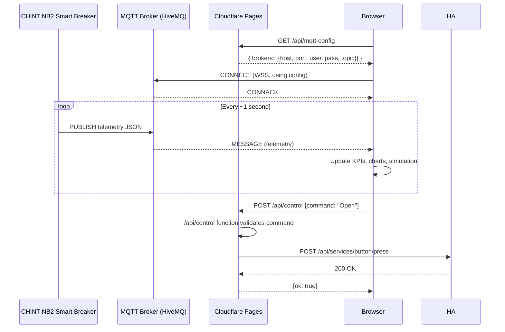

# System Architecture

## Overview

The Digital Twin follows a **3-tier cloud edge architecture**:

```
IoT Layer → MQTT Broker Layer → Cloudflare Edge → User Browser
                                      ↑
                               Home Assistant
```

---

## Component Descriptions

### 1. Physical Panel (IoT Layer)

| Component | Role |
|---|---|
| **40 × Philips LED lamps** | Physical load — 11 W each, ~402 W total |
| **CHINT NB2 Smart Circuit Breaker** | Din-rail smart breaker with built-in metering — measures voltage, current, active power, and power factor; publishes telemetry via integrated WiFi module |
| **Home Assistant** | Automation hub; receives telemetry from the NB2 breaker and exposes button entities for remote control (Open / Close / Unlock) |

### 2. MQTT Broker Layer (Real-time Data Channel)

Live telemetry is published from the **CHINT NB2 Smart Breaker** to MQTT brokers in JSON format:

```json
{
  "power_w": 401.8,
  "voltage_v": 229.7,
  "current_a": 2.93,
  "power_factor": 0.597,
  "energy_kwh": 1.243
}
```

Two cloud MQTT brokers are used for redundancy:

| Broker | Protocol | Port | Role |
|---|---|---|---|
| HiveMQ Cloud | MQTT over WSS | 8884 | Primary |
| EMQX Cloud | MQTT over WSS | 8084 | Failover |

The browser subscribes directly via **MQTT.js over WebSocket Secure (WSS)**, with automatic broker failover.

### 3. Cloudflare Pages (Edge Serving + Serverless Functions)

All static assets are served from Cloudflare's global CDN edge network.

Cloudflare Pages Functions provide serverless API endpoints:

| Endpoint | Method | Purpose |
|---|---|---|
| `/api/mqtt-config` | GET | Returns MQTT broker hostnames/credentials from secrets |
| `/api/control` | POST | Proxies button commands to Home Assistant REST API |
| `/api/data` | GET | Returns current telemetry snapshot |
| `/api/history` | GET | Returns historical telemetry data |
| `/api/real_analytics` | GET | Returns verified analytics dataset |

This architecture ensures that **no credentials are ever embedded in the public JavaScript bundle** — the browser fetches config from the secure serverless function at boot.

### 4. Browser (Presentation + Simulation Layer)

The single-page application runs entirely in the browser after the initial page load:

- **MQTT.js** subscribes to the telemetry topic and drives all live KPI cards and charts
- **Chart.js** renders real-time trend charts and historical analytics
- **`<model-viewer>`** renders the interactive 3D GLB model of the physical panel
- **Physics simulation engine** (custom JS) computes junction temperatures, lumen decay, and aging curves using the thermal model `T_j = T_amb + P × Rₜₕ`
- **SCADA alarm engine** evaluates thresholds on each telemetry tick and generates ISA-101 severity-classified alarms

---

## Data Flow Diagram



---

## Security Design

| Concern | Mitigation |
|---|---|
| MQTT credentials in public JS | Never hardcoded; fetched from `/api/mqtt-config` at runtime |
| HA token in public JS | Never hardcoded; used only server-side in Cloudflare Function |
| Broker config caching | `Cache-Control: private, max-age=300` (browser only, not CDN) |
| Cloudflare Access | Optionally enable with `REQUIRE_ACCESS=true` secret |
| `.dev.vars` secrets | In `.gitignore`; template provided as `.dev.vars.example` |
