# Smart Meter — Intelli-Meter

**Intelli-Meter: A Virtual Prototyping Framework for Smart Metering using Advanced
Algorithms** — Graduation Project (EE4990), developed by **Abdulrahman Mahjoub** and
**Osama Abdulqader**, supervised by **Dr. Malik Alduhaymi** and **Dr. Ibrahim Marabet**,
Term 2, 1447H (2025). Funded by Prince Sattam Bin Abdulaziz University and Zhejiang
CHINT Electrics.

Intelli-Meter targets the three limitations of conventional smart meters: they only report
aggregate consumption (no per-appliance visibility), they're vulnerable to electricity theft,
and their forecasting is often inaccurate. It integrates three computational modules into one
system, validated as a virtual prototype against real consumption data.

## The three modules

| Module | Method | What it does |
|---|---|---|
| **Load disaggregation (NILM)** | Factorial Hidden Markov Model (FHMM) | Breaks aggregate power into per-appliance profiles without sub-metering hardware |
| **Load forecasting** | Deep stacked LSTM (3 layers, dropout 20%) | Predicts 24-hour demand for planning and budgeting |
| **Theft detection** | Hybrid CUSUM + LSTM cross-check | Flags statistical anomalies, then verifies them against the LSTM forecast to cut false alarms |

### Load disaggregation (NILM)

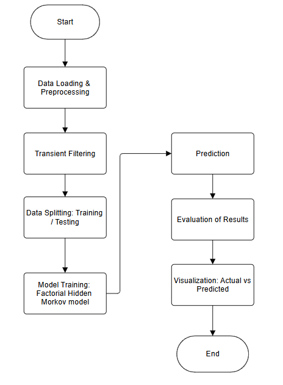

FHMM was chosen because it models multi-state appliances (e.g. a washing machine's
wash/spin cycles) rather than simple ON/OFF devices, and accounts for the probability of
transitioning between states. Pipeline: preprocessing (resample + median-filter transients) →
train FHMM on labelled data (emission + transition probabilities) → infer the most likely
appliance state sequence via the Viterbi algorithm → evaluate with MAE / Energy Error / F1.

### Load forecasting

A sliding-window (lookback = 10 steps) turns the time series into a supervised-learning
problem. The core model is a **3-layer stacked LSTM** — the first two layers extract temporal
features (`return_sequences=True`), the third compresses them into a fixed-length context
vector — with 20% dropout after each layer, trained with Adam and early stopping
(patience = 10) to prevent overfitting.

### Theft detection (Hybrid CUSUM + LSTM)

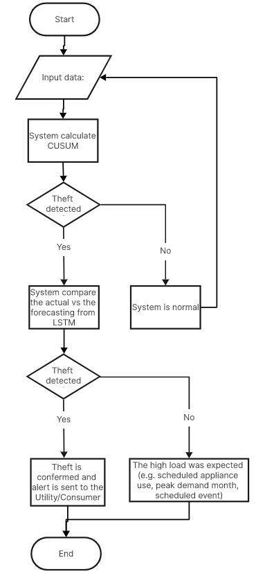

Traditional smart meters use static thresholds, which miss **Small-amount Electricity Theft
(SET)** — small, persistent skimming that stays inside normal noise. Intelli-Meter runs a
**CUSUM control chart** (sensitive to small sustained shifts) as the first pass; when CUSUM
flags an anomaly, the system cross-checks it against the **LSTM forecast** before alerting —
if the LSTM predicted high load anyway (e.g. hot day, AC load), it's dismissed as a false
alarm rather than reported as theft.

## Results

Evaluated on real household consumption data (`House_2.csv`):

| Appliance | MAE | Energy Error | F1 |
|---|---:|---:|---:|
| Kettle (ON/OFF, high power) | 2.7 W | 12.7% | 0.922 |
| Dishwasher (multi-state) | 34.1 W | 24.1% | 0.578 |
| Washing machine (multi-state) | 33.3 W | 60.7% | 0.192 |

*Single-state, high-power devices (kettle) disaggregate far more accurately than multi-state
devices (washing machine) — consistent with the FHMM's known weakness on complex,
variable-power cycles.*

| Kettle | Dishwasher | Washing machine |
|---|---|---|
| 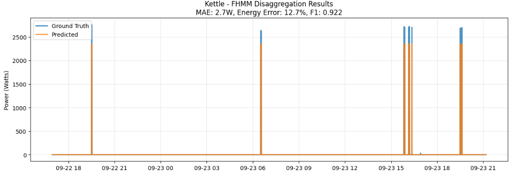 | 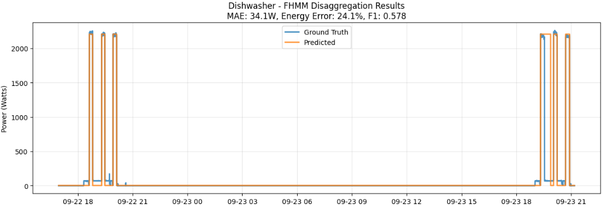 | 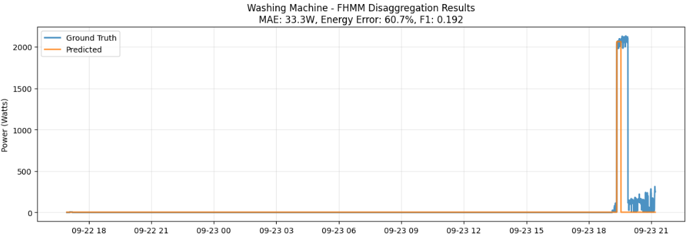 |

**Load forecasting** — actual vs. predicted on the held-out test set:

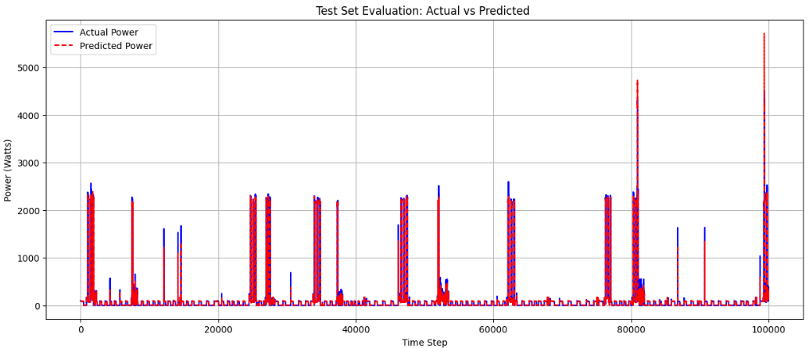

**Theft detection** — CUSUM score climbing as more appliances are added to a simulated
theft, correctly staying under the control limit for the normal baseline and crossing it as
theft scales up:

| Normal baseline | Theft: 1 appliance | Theft: 2 appliances | Theft: 3 appliances |
|---|---|---|---|
| 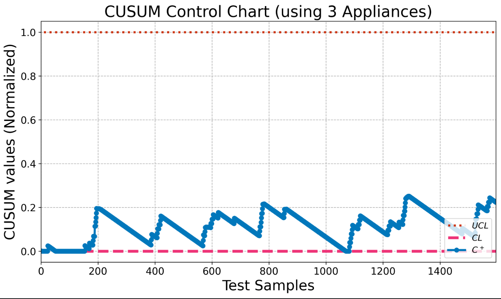 | 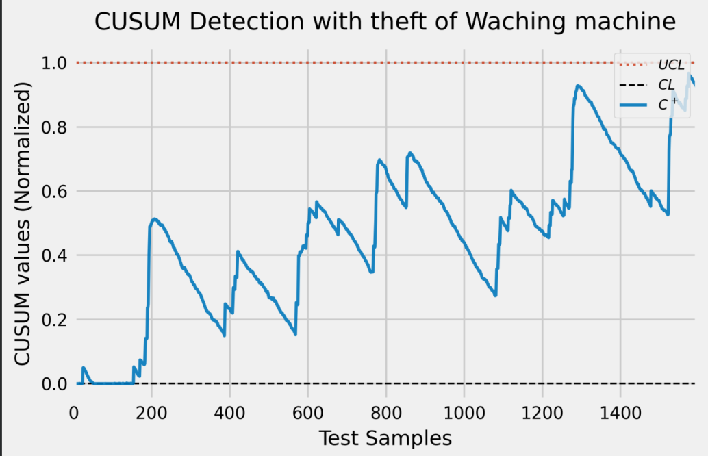 | 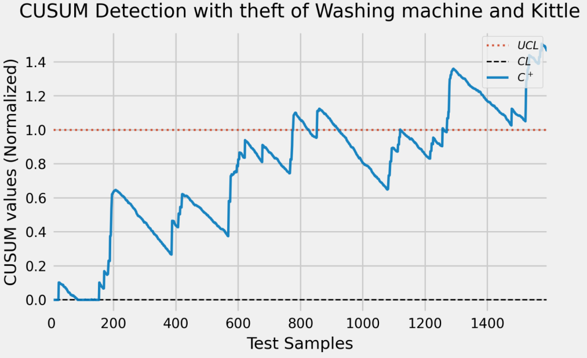 | 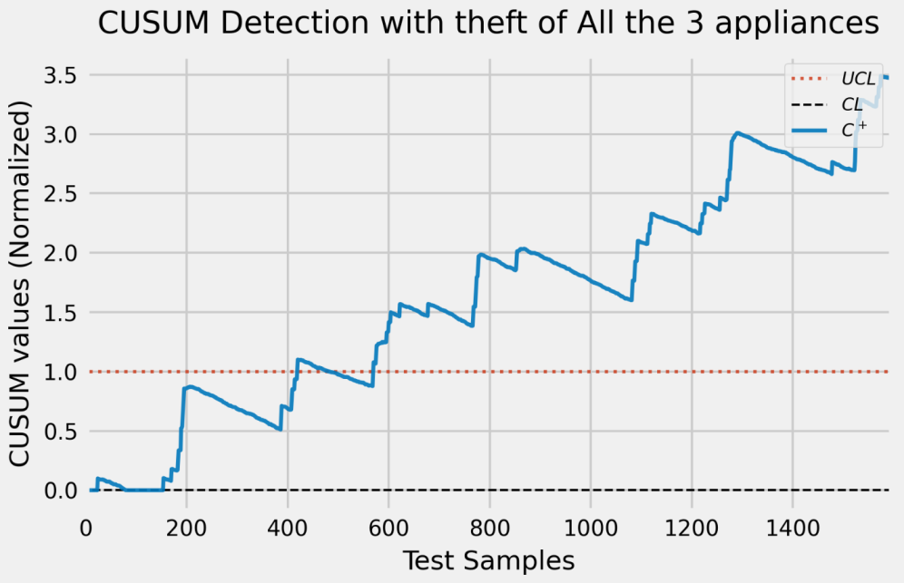 |

## Implementation status

A phased strategy was used: the software core is fully built and validated; the physical
hardware is real but not yet wired into the live dashboard.

| Layer | Status |
|---|---|
| Algorithms (NILM / LSTM / CUSUM) | ✅ Implemented, validated on real dataset |
| Dashboard | ✅ Fully functional, running on `House_2.csv` |
| Hardware node (ESP32 + CHINT breaker) | ✅ Built and tested — currently in **data-recording mode**, generating a custom Saudi-household dataset |
| Real-time hardware → dashboard streaming | ⏳ Future work |

### Hardware node

- **Microcontroller:** ESP32-S3-WROOM-1 (dual-core, Wi-Fi, edge computing)
- **Metering:** CHINT NB2-80ZT Smart Miniature Circuit Breaker (V / I / P / PF)
- **Isolation:** QYF838 module — galvanic isolation between the high-voltage MCB and the low-voltage ESP32
- **Firmware:** ESPHome, integrating with Home Assistant / MQTT for logging

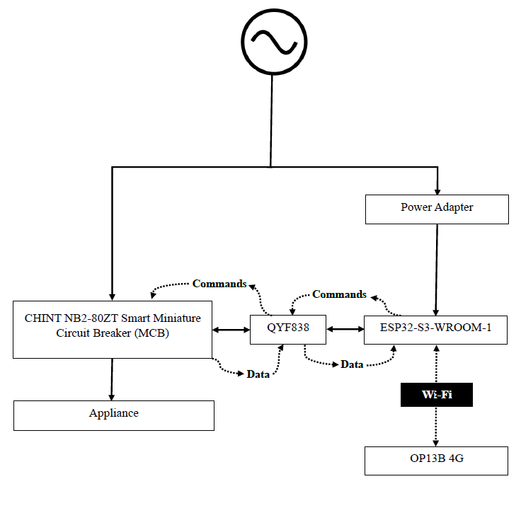

The prototype was tested live, monitoring a washing machine circuit at ~377 W:

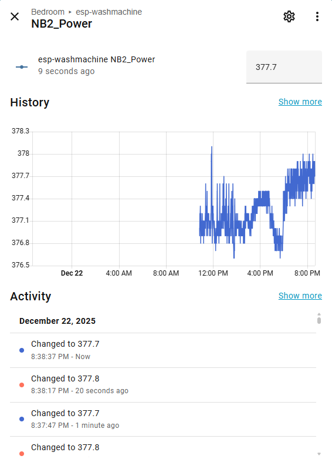

### Behavioral survey

A survey of Saudi households was used to shape the virtual dashboard's assumptions (device
mix, peak usage windows):

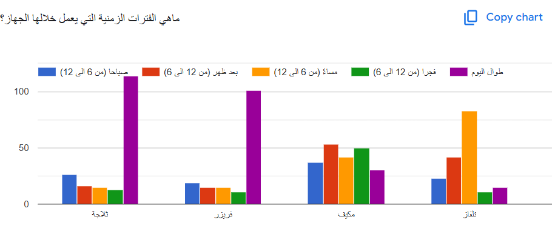

## The dashboard

Three views, all built on the same backend:

| Disaggregation | Forecasting | Health & Theft |
|---|---|---|
| 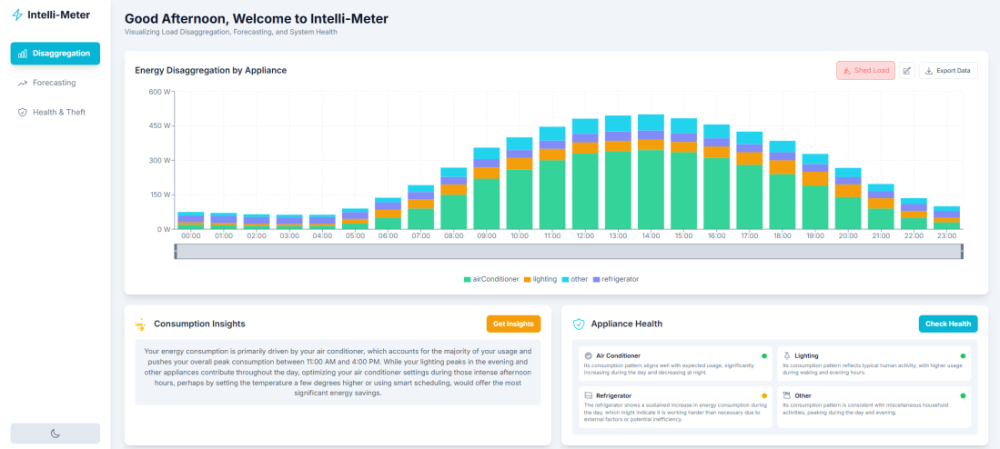 | 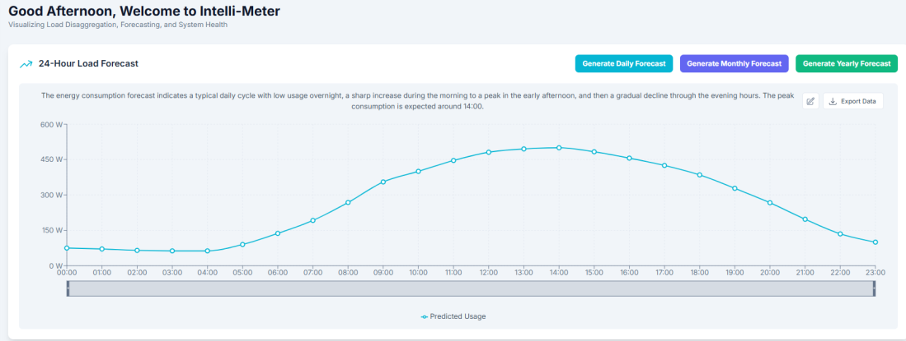 | 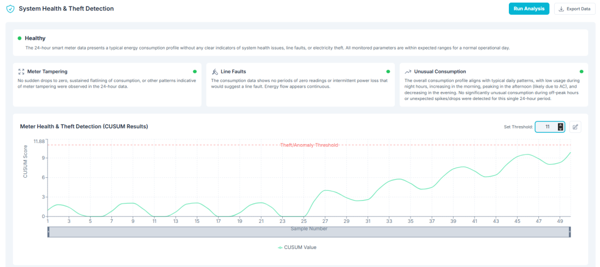 |

## Google Colab Notebook

[Intelli-Meter.ipynb on Google Colab](https://colab.research.google.com/drive/1G199XtU2leIWHnVgL8FWiT7J4jNfE0ZU)
(hosted on Google Drive — if the link asks for access, request it from the project owner).

A **read-only PDF export** of the notebook (code + all outputs, as of the last run) is included
directly in this repo: [`Intelli-Meter_Colab_notebook.pdf`](Intelli-Meter_Colab_notebook.pdf).

## Project Files

- [`Intelli-Meter_2.0.pptx`](Intelli-Meter_2.0.pptx) — the project presentation deck this page's
  content and figures are sourced from.
- [`Intelli-Meter_Colab_notebook.pdf`](Intelli-Meter_Colab_notebook.pdf) — PDF export of the
  Colab notebook (see above for the live, editable version).

## Relationship to Data Setup

Intelli-Meter's current models train on an existing household dataset (`House_2.csv`), not
the lab's own rig. Its hardware node, however, is architecturally the same approach as the
lab's **[Data Setup](../DataSetup/)** toolkit (ESP32 + CHINT smart breaker), and is currently
recording a custom, localized Saudi-appliance dataset for future model retraining — the two
efforts are expected to converge as both mature.

## Pilot deployment: SE + CHINT (planned)

The project's CHINT funding and hardware already connect it to the lab's broader
smart-metering direction: a planned field pilot with **Saudi Electricity (SE)** and **CHINT**
to move from lab data to field validation.

| Partner | Role |
|---|---|
| **CHINT** | Smart metering / breaker hardware and integration; project co-funder |
| **Saudi Electricity (SE)** | Host premises, field load data, grid-code alignment |
| **Future Energy Lab** | Data Setup replication, model development, validation protocol |

**Path:** Lab dataset → Field pilot → Scale-up.

> **Status:** stated plan and direction — the formal partnership agreement and pilot
> document are not yet in place.

## Standards considered

IEC 62052-11 (general metering) · SASO IEC/TR 62059-11 (dependability) · SASO IEC
62056-53/62 (data exchange for meter reading, tariff, load control) · SASO IEC 61557-11
(LV electrical safety) · IEEE 802.15.4 (wireless comms) · IEC 61850 (utility automation
comms) · IEC 61010-1 (measurement equipment safety). Full compliance/certification testing
is out of scope for this graduation project; alignment is demonstrated by functional
validation and simulation.

## Future work

Bridge the two current phases — stream the ESP32 hardware node's live data directly into
the dashboard, replacing the `House_2.csv` simulation with real-time local telemetry.
