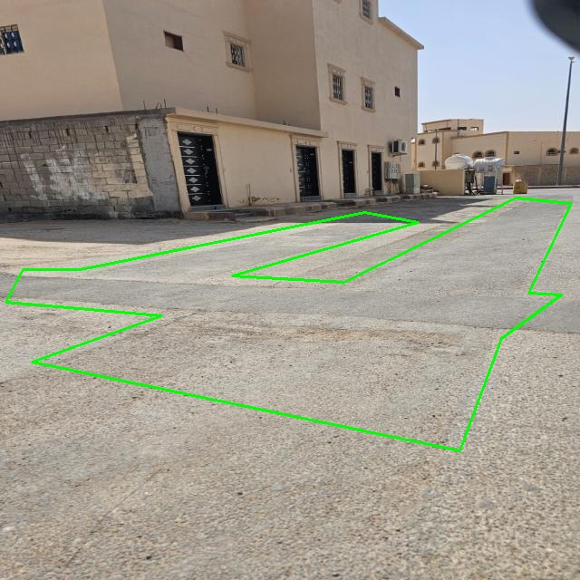
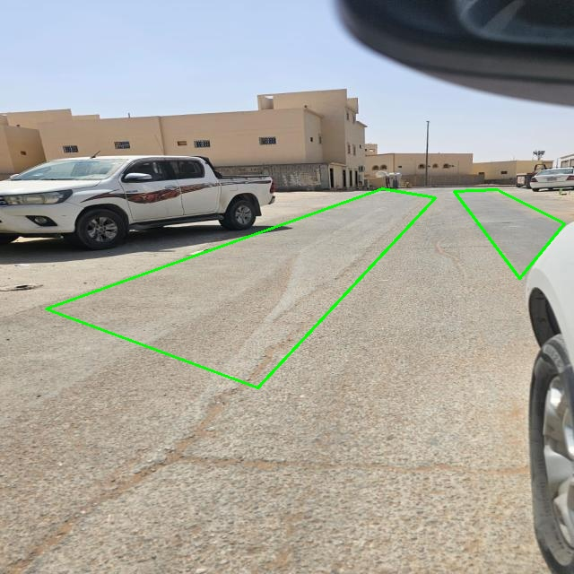
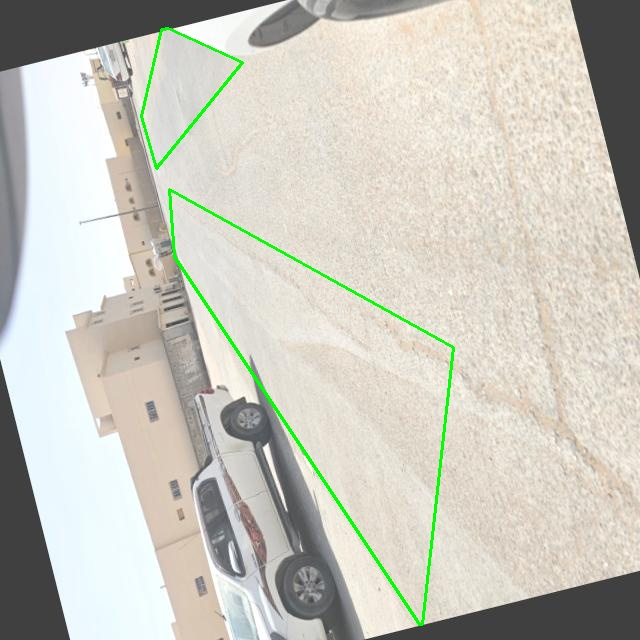

# Low-Voltage Distribution Topology Inference — Trench Footprint Segmentation

Research on inferring **low-voltage (LV) distribution network topology** — part of the lab's
broader work on management and operation of distribution networks: topology inference, state
estimation, and operational decision support for low- and medium-voltage networks (see
[`docs/RESEARCH.md`](../docs/RESEARCH.md)).

## The problem

Utilities often don't have an accurate, up-to-date map of how LV feeders are actually laid out
underground — as-built records drift from reality after repairs, extensions, and undocumented
work. A repaired/backfilled trench leaves a visible **surface footprint** (a patched strip of
pavement) that traces the cable route beneath it. Detecting these footprints from ordinary
photos or video is a cheap, scalable way to recover real cable routing without excavation.

## Approach: trench-footprint segmentation

[`trench_footprint_segmentation.ipynb`](trench_footprint_segmentation.ipynb) trains a
**YOLO11-seg instance segmentation model** to draw a pixel-accurate outline of trench
footprints directly from street-level photos and video:

1. **Dataset**: a custom-labelled road/pavement dataset (COCO polygon annotations), converted
   to YOLO segmentation format with a train/val split.
2. **Training**: `yolo11s-seg.pt` fine-tuned for 100 epochs at 640 px.
3. **Validation**: standard YOLO segmentation validation metrics on the held-out set.
4. **Inference**: the trained model runs on uploaded test video, producing an annotated
   video with the trench footprint segmented frame-by-frame.

### Real labelled samples from the dataset

| | | |
|---|---|---|
|  |  |  |

*Green outlines are the ground-truth polygon labels used to train the segmentation model —
each traces a patched/backfilled trench strip on ordinary residential pavement in Saudi
Arabia.*

## Relationship to the publications

This segmentation model is the trench-footprint detection component of:

| Venue | Title | Status |
|---|---|---|
| Journal | Inferring Low-Voltage Distribution Topology from Trench Footprints: A Deep Learning Framework with Infrared Thermal Validation | Accepted |
| Conference (IEEE) | Inferring Low-Voltage Distribution Topology from Trench Footprints: A Deep Learning Framework | Published — [ieeexplore.ieee.org/document/11365432](https://ieeexplore.ieee.org/document/11365432) |

See [`docs/PUBLICATIONS.md`](../docs/PUBLICATIONS.md) for the full, up-to-date publication list.

> **Scope note:** this notebook covers the RGB trench-footprint segmentation stage only. The
> **infrared thermal validation** referenced in the journal paper's title is a separate part
> of the work and is not (yet) included here.

## Status

The segmentation notebook and sample training images are public in this repository. The full
underlying dataset and the infrared-thermal validation code are not yet public — they will be
added once cleared for release.
